import Tabs from "@theme/Tabs";
import TabItem from "@theme/TabItem";

# TethysDash: Creating Custom Plugins

This tutorial picks up where [TethysDash: Creating Dashboards](./04-tethysdash-creating-dashboards.md) left off. You will extend the dashboard from Part 1 by connecting the map's `comid` attribute to a new variable input, then adding a GeoGLOWS forecast plot that updates whenever the user clicks a river segment on the map.

## Objectives

- Understand the TethysDash plugin API by reading a real example
- Connect a map attribute to a variable input so clicks write to dashboard state
- Add the GeoGLOWS Forecast Plot either as a **Grid Item** on the dashboard, or as a **Popup Modal** that opens on river click

## Prerequisites

- Complete [TethysDash: Creating Dashboards](./04-tethysdash-creating-dashboards.md). You should have a dashboard named **GEOGLOWS Demo** that contains a Map of Chinese GEOGLOWS flowlines and a **Base Map** variable input.
- A local installation of TethysDash, see [Installation and Setup — TethysDash](https://tethysdash.readthedocs.io/en/latest/installation.html#quick-installation).
- The [tethysdash_examples](https://github.com/FIRO-Tethys/tethysdash_examples) plugin package must be installed as a TethysDash dependency. It provides the `GeoGLOWS Forecast Plot` visualization used in this tutorial.

## Steps

### Step 1 — Edit the dashboard

Open your **GEOGLOWS Demo** dashboard and click the **Edit** (pencil) icon in the toolbar to enter edit mode.

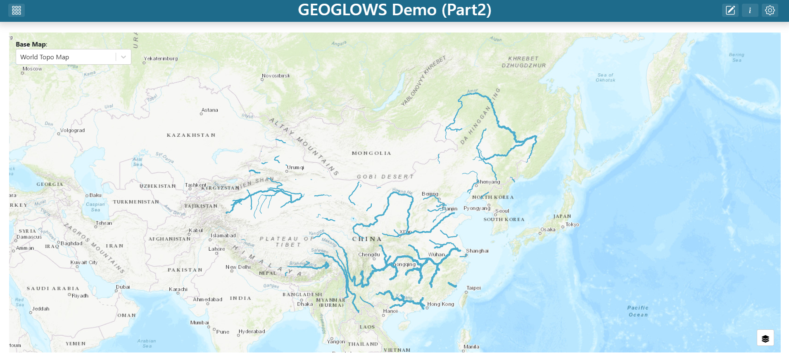

### Step 2 — Edit the map layer

1. Find the map grid item, click its three-dot menu, and click **Edit**.
2. In the map editor's **Layers** list, click the **China Flowlines** layer to open the layer editor.

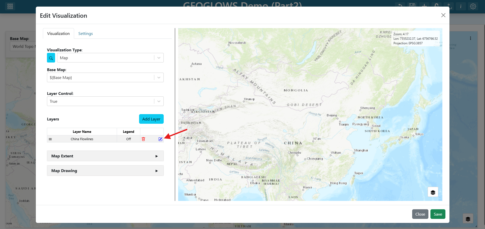

### Step 3 — Connect `comid` to a `river_id` variable input

1. Switch to the **Attributes/Table Popup** tab in the layer editor.
2. Find the `comid` row.
3. Set its **Alias** to "River ID".
4. Set its **Variable Input Name** to `river_id`.

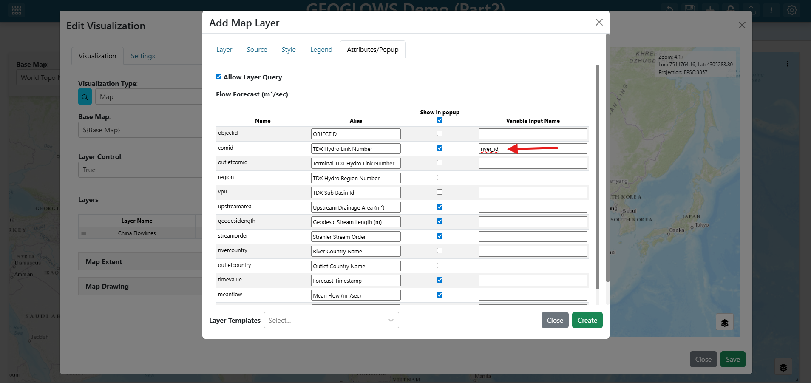

> Setting a variable input name on an attribute means: whenever a user clicks a feature on the map, that feature's value for this attribute is written to the named variable input. Any visualization that references `${river_id}` will then re-fetch with the new value. This is used in the **Grid Item** path below. In the **Popup Modal** path the popup instead uses `${feature.comid}` directly, so the variable input binding is optional — but setting it costs nothing and keeps both paths open.
>
> See [Attributes and Popups](https://tethysdash.readthedocs.io/en/latest/maps/attributes_and_popups_tab.html) for the full reference on attribute aliases and click-to-variable bindings.

5. Click **Create** at the bottom of the layer editor.
6. Click **Save** at the bottom of the map editor.

### Step 4 — Inspect the GeoGLOWS Forecast Plot plugin

The visualization you are about to add is provided by a TethysDash _visualization plugin_ — an external Python package that subclasses `TethysDashPlugin` and is auto-discovered when installed alongside TethysDash. The [Plugins](https://tethysdash.readthedocs.io/en/latest/plugins.html) page is the full reference for the plugin API: every supported `type`, every `args` field type, `send_update`, packaging, and discovery.

Here is the full source for the `GeoGLOWS Forecast Plot` plugin from the [tethysdash_examples](https://github.com/FIRO-Tethys/tethysdash_examples) repository:

```python
from tethysapp.tethysdash.plugin_helpers import TethysDashPlugin
import requests


class GeoGLOWSForecastPlot(TethysDashPlugin):
    name = "geoglows_forecast_plot"
    group = "Tutorials"
    label = "GeoGLOWS Forecast Plot"
    type = "plotly"
    tags = [
        "example",
        "plotly",
        "tutorial",
        "geoglows",
    ]
    description = "A GeoGLOWS forecast plot for the GeoGLOWS tutorial"
    args = {"river_ID": "number"}

    def run(self):
        self.send_update("Loading forecast data from GeoGLOWS API...")
        url = f"https://geoglows.ecmwf.int/api/v2/forecast/{self.river_ID}?format=json"
        response = requests.get(url)
        forecast_data = response.json()

        self.send_update("Processing forecast data...")
        data = [
            {
                "type": "scatter",
                "x": forecast_data["datetime"],
                "y": forecast_data["flow_uncertainty_lower"],
                "name": "Lower Uncertainty",
                "line": {"color": "lightblue"},
            },
            {
                "type": "scatter",
                "x": forecast_data["datetime"],
                "y": forecast_data["flow_uncertainty_upper"],
                "name": "Upper Uncertainty",
                "line": {"color": "lightblue"},
                "fill": "tonexty",
                "fillcolor": "lightblue",
            },
            {
                "type": "scatter",
                "x": forecast_data["datetime"],
                "y": forecast_data["flow_median"],
                "name": "Median Forecast",
                "line": {"color": "darkblue"},
            },
        ]

        layout = {
            "title": f"GeoGLOWS Forecast ({self.river_ID})",
        }

        config = {"displayModeBar": True}

        return {"data": data, "layout": layout, "config": config}
```

Key things to understand before wiring the plugin into the dashboard:

| Attribute         | Value                                      | What it means                                                                |
| ----------------- | ------------------------------------------ | ---------------------------------------------------------------------------- |
| `name`            | `"geoglows_forecast_plot"`                 | Unique identifier written into the dashboard JSON's `source` field           |
| `label` / `group` | `"GeoGLOWS Forecast Plot"` / `"Tutorials"` | How the plugin appears in the **Visualization Type** dropdown                |
| `type`            | `"plotly"`                                 | TethysDash renders `run()`'s return value as a Plotly figure                 |
| `args`            | `{"river_ID": "number"}`                   | Declares a single numeric input; TethysDash auto-renders a form field for it |

The `run()` method fetches the forecast for `self.river_ID` from the GeoGLOWS REST API, builds three Plotly traces (lower-uncertainty band, upper-uncertainty band, and median forecast), and returns them in the standard Plotly figure shape. The `self.send_update(...)` calls stream progress messages back to the dashboard over WebSocket while `run()` is in flight, so the user sees status instead of a silent spinner.

---

Choose how to display the forecast plot:

<Tabs groupId="approach">
<TabItem value="grid" label="Grid Item" default>

**Step 5 — Add a new dashboard item**

Click the **+ (Add Dashboard Item)** icon in the toolbar. A new empty grid item appears on the dashboard.

**Step 6 — Configure the GeoGLOWS Forecast Plot**

1. Find the new grid item, click its three-dot menu, and click **Edit**.

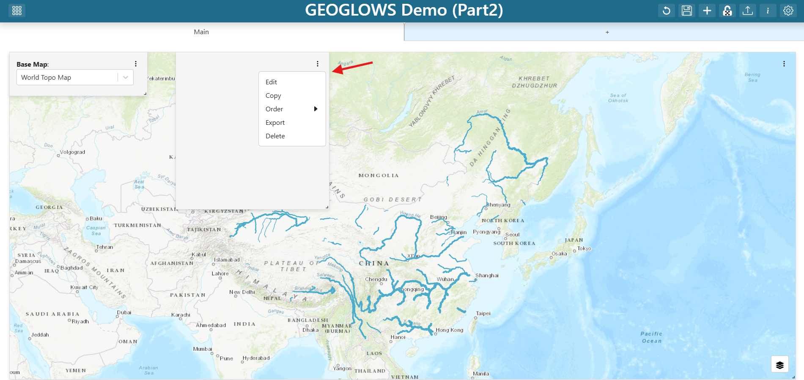

2. Set the **Visualization Type** to `GeoGLOWS Forecast Plot` (under the **Tutorials** group).
3. Set the plot's properties:
   - **River ID:** `${river_id}`

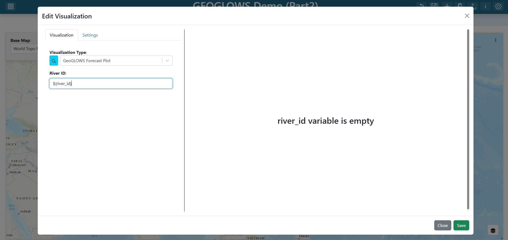

The `${river_id}` template tells the plot to read from the variable input you connected to the map. When the user clicks a river segment, the plot re-fetches the forecast for that segment's `comid`.

**Step 7 — Configure the plot's settings**

Until the user clicks a river, `river_id` has no value. Configure a friendly placeholder so the plot does not look broken, and set a background color so the plot stands out from the map.

1. Switch to the **Settings** tab in the visualization editor.
2. Under **On Any Empty Variable**, enter: `Click on a river to see the GeoGLOWS forecast`
3. Set the **Background Color** to `#dbdbdb` (light grey).

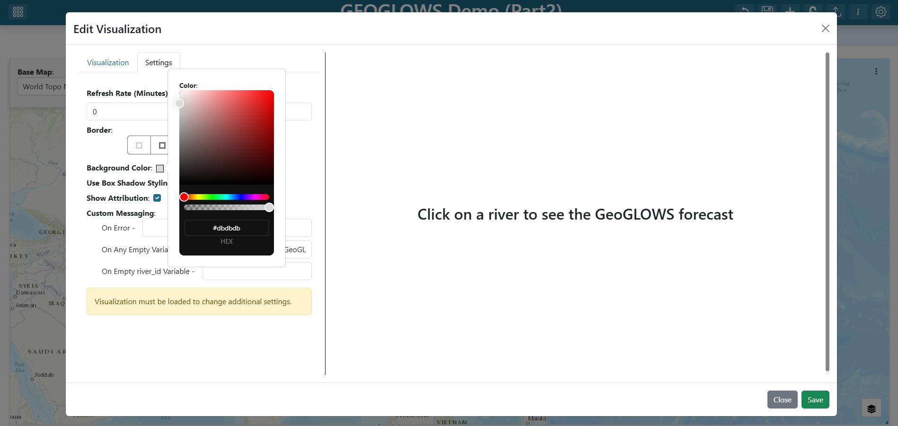

> See [Dashboard Visualizations](https://tethysdash.readthedocs.io/en/latest/dashboard_visualizations.html) for every option in the visualization Settings tab.

**Step 8 — Save the item**

Click **Save** at the bottom of the visualization editor. The new grid item now renders the placeholder message.

**Step 9 — Resize and place the plot**

Drag the bottom-right corner of the new grid item to resize it. A common layout is to place the plot below the map spanning the full dashboard width so the forecast is easy to read at a glance.

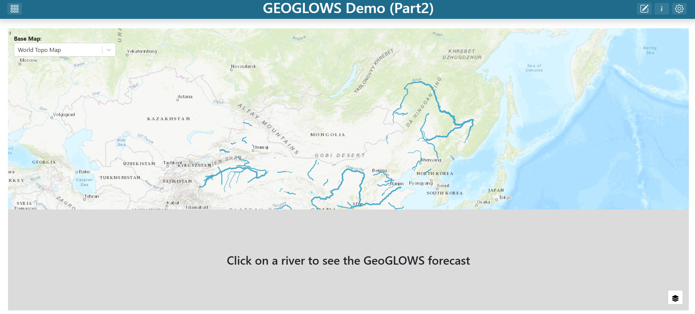

</TabItem>
<TabItem value="modal" label="Popup Modal">

**Step 5 — Enable Custom Popup Modal on the layer**

Custom floating popup modals are a great way to show contextual information without taking up permanent dashboard real estate. In this approach, the GeoGLOWS Forecast Plot only appears when the user clicks a river segment, and it floats on top of the map instead of being embedded in the grid.

1. Find the map grid item, click its three-dot menu, and click **Edit**.
2. In the map editor's **Layers** list, click the **China Flowlines** layer to open the layer editor.
3. Switch to the **Custom Modal Popup** tab.
4. Check the **Enable Custom Popup Modal** checkbox.
5. Set the **Title Template** to:

```
GeoGLOWS Forecast — ${feature.comid}
```

The `${feature.comid}` token is replaced at runtime with the `comid` of whichever river segment the user clicked.

6. Leave the **Default Position** at the default (60 × 60%, centered) or drag the canvas rectangle to reposition and resize the modal.

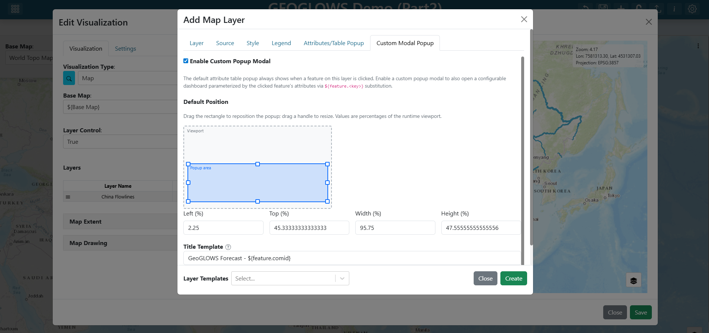

**Step 6 — Add the forecast plot to the popup layout**

Click **Edit popup layout**. A mini-dashboard editor opens — this is the content that appears inside the modal when the user clicks a river.

1. Click **+ (Add Visualization)** in the mini-dashboard toolbar.
2. Find the new grid item, click its three-dot menu, and click **Edit**.
3. Set the **Visualization Type** to `GeoGLOWS Forecast Plot` (under the **Tutorials** group).
4. Set the plot's properties:
   - **River ID:** `${feature.comid}`

> Inside the popup layout, use `${feature.<key>}` to reference the clicked feature's attributes. This is different from the `${river_id}` variable input substitution used on the main dashboard. `${feature.comid}` resolves to the `comid` of whichever river segment was clicked.

5. Click **Save** on the visualization editor.
6. Resize the plot grid item to fill the popup area.

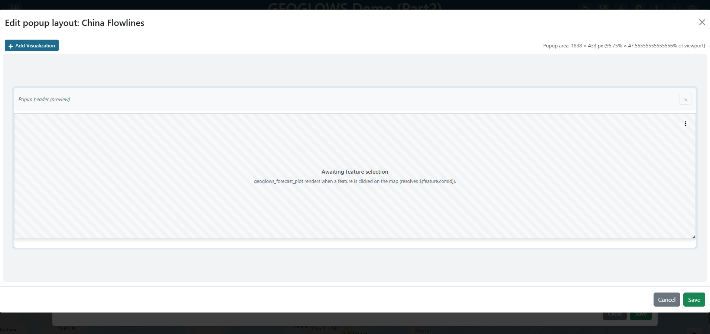

7. Click **Save** to close the popup layout editor.

**Step 7 — Save the layer and map**

1. Click **Create** at the bottom of the layer editor.
2. Click **Save** at the bottom of the map editor.

</TabItem>
</Tabs>

### Step 10 — Save the dashboard

Click the dashboard **Save** (disk) icon in the toolbar to persist your changes.

### Try it out

Exit edit mode and zoom in on the map past zoom 12 until the flowlines render.

<Tabs groupId="approach">
<TabItem value="grid" label="Grid Item" default>

Click any river segment in China — the GeoGLOWS Forecast Plot grid item should immediately re-render with the forecast for that `comid`. Click a different segment and the plot updates again.

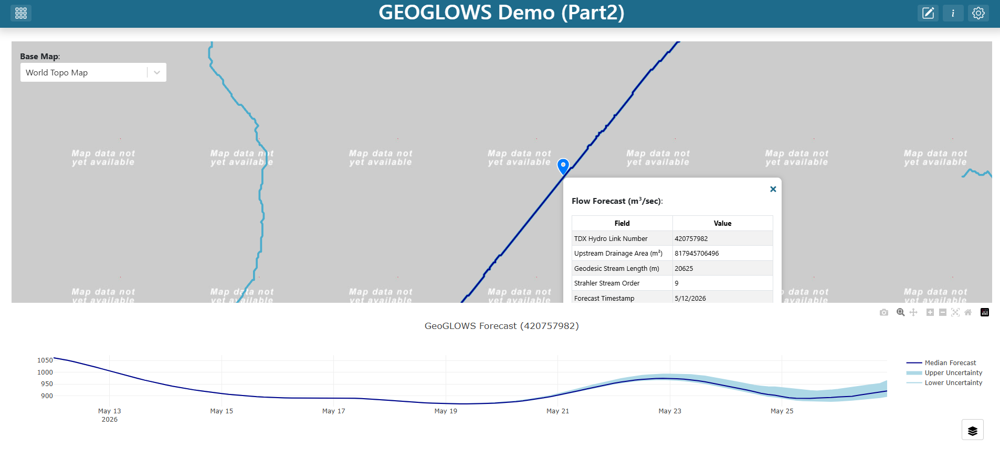

</TabItem>
<TabItem value="modal" label="Popup Modal">

Click any river segment in China — a floating popup modal should appear over the map showing the GeoGLOWS forecast for that segment's `comid`, with the title `GeoGLOWS Forecast — <comid>`. Close the modal with the **×** button and click a different segment to confirm the title and chart update.

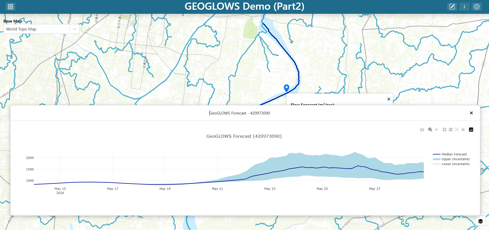

</TabItem>
</Tabs>

## Solution

Download and import the completed dashboard: [GEOGLOWS_China_TethysDash_Part2.json](./GEOGLOWS_China_TethysDash_Part2.json)

This file can be imported into TethysDash via the **Import Dashboard** button on the landing page. It matches the **Grid Item** version built in this tutorial.
